<!--
### Hi there 👋

**IamRezaMousavi/IamRezaMousavi** is a ✨ _special_ ✨ repository because its `README.md` (this file) appears on your GitHub profile.

Here are some ideas to get you started:

- 🔭 I’m currently working on ...
- 🌱 I’m currently learning ...
- 👯 I’m looking to collaborate on ...
- 🤔 I’m looking for help with ...
- 💬 Ask me about ...
- 📫 How to reach me: ...
- 😄 Pronouns: ...
- ⚡ Fun fact: ...
-->

<!-- markdownlint-disable MD033 -->
<h1 align="center">A Software Engineer</h1>

## 💻 Tech Stack

 

 

 

 

 

 

 

 

## 📊 GitHub Stats

More Details

### 🏆 GitHub Trophies

---

### 💰 You can help me by Donating

<!-- markdownlint-enable MD033 -->
